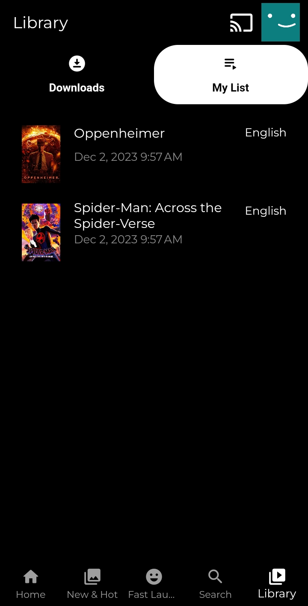

# Movie App

A movie application that utilizes The [TMDB] API, following Domain Driven Design (DDD) architectural principles.

## Features

- **Login**: Utilizes [Shared Prefernces] to effectively manage and store login details, including the login status.
  - Note: *The app uses dummy password checking, allowing users to log in if the values entered for username and password are exactly the same (e.g., username: abc, password: abc).*

- **Multiple Profiles**: Enables multiple profiles within an account, allowing users to add and choose profiles after logging in.

- **Search**: Incorporates [Infinite Scroll Pagination] for searching movies, enhancing the user experience.

- **Movie Details**: Creates a movie details screen and enables the addition of movies to a personalized '**My List**', with separate lists stored in a local database for each user profile.

- **[Share Plus]**: Implements the feature to share movies (text) with a direct link that opens in the app.

- **Deep Linking**: The app can be directly launched to a screen through a clickable link, utilizing `movieapp.com` as the link. Uses [Go Router] for routing.
  - Note: *The domain is used for study purposes and doesn't imply ownership.*

- **State Management**: Utilizes [Bloc] for effective state management.

- **Local Database**: Uses [SQFlite] for local database.

- **Cached Network Image**: Incorporates [Cached Network Image] for efficient image loading.

## Running the project

- Clone the repository
- Get a [TMDB] API token (easy step; there are a lot of tutorials helping with it).
- Create a file named `api_key.dart` in the path `/lib/infrastructure/core/` and add the following content:

```dart
// api_key.dart

const accessToken = 'YOUR_TOKEN_HERE';
```
Replace YOUR_TOKEN_HERE with your actual API token.

-  Run in command line

```bash
cd movie_app
flutter pub get
flutter run
```

 Note : *The application was run on Android while in development and was not tested on iOS.*
 ## Screenshots
 <p align="center">
  
  
    
  
  
  
  
  
  
  
  
  
  
</p>

[TMDB]: <https://developer.themoviedb.org/reference/intro/getting-started>
[Shared Prefernces]: <https://pub.dev/packages/shared_preferences>
[Share Plus]:<https://pub.dev/packages/share_plus>
[Bloc]:<https://pub.dev/packages/flutter_bloc>
[Go Router]:<https://pub.dev/packages/go_router>
[SQFlite]:<https://pub.dev/packages/sqflite>
[Infinite Scroll Pagination]:<https://pub.dev/packages/infinite_scroll_pagination>
[Cached Network Image]:<https://pub.dev/packages/cached_network_image>